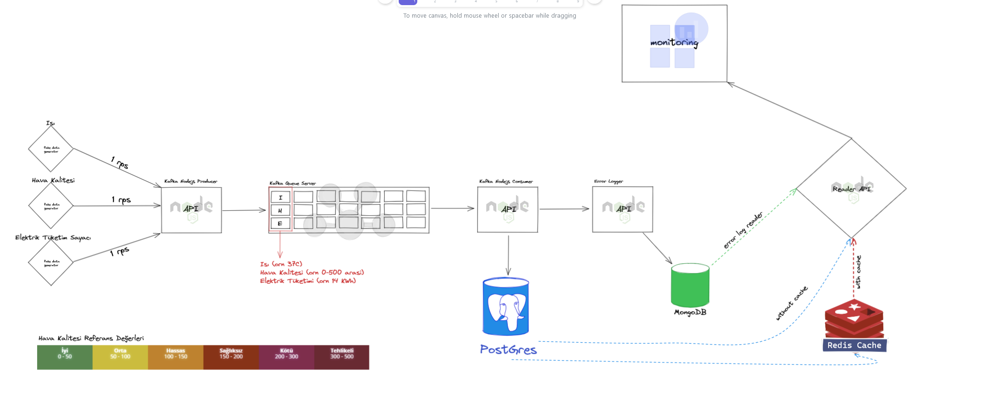
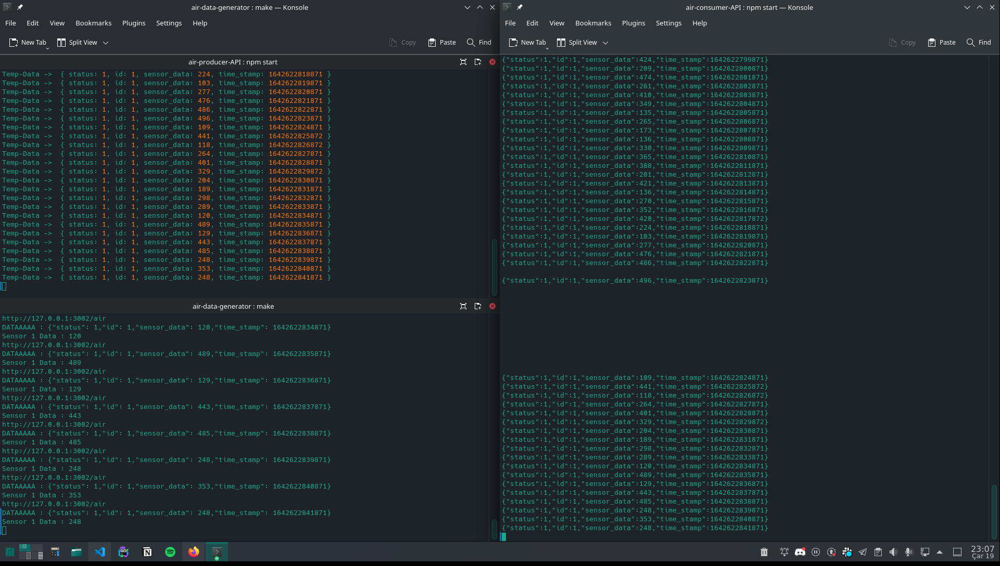
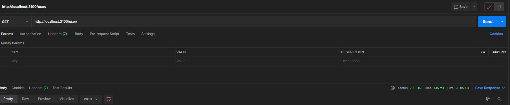
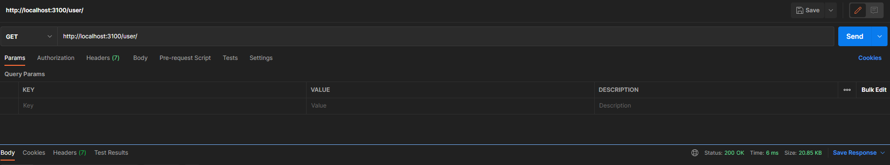

# Okul Enerji Takip Sistemi

## Tanıtım

Okul enerji takip sistemi (monitoring). Okullarda bulunan sınıfların, ısı dereceleri, hava kaliteleri ve sınıfın ortalama elektrik tüketimini takip edebileceğimiz bir microservice serisiyapılacak.

3 farklı sensor simule edilip saniyelik olarak data üretecek. Üretilen bu data REST API (producer) tarafından okunup kuyruğa eklenecek. Kuyruğa eklenen verilerin işlenmesini yine REST API(consumer) tarafı işleyip veritabanına kaydedecek. Hata oluşması durumunda Mongodb’ye error logları başka bir API ile işlenecek. Son olarak tüm dataları okumak ve error logları takip için bir Reader API geliştirilip sistemin herşeyi o api aracılığı ile analiz ya da monitorize edilebilecek.

- Sistemde 3 farklı veritabanı kullanılacak.
- Tüm Servisler NodeJS ile yazılacak
- Geliştirme ortamı olarak Docker teknolojisi kullanılacak
- Tüm öğrencilere Nodejs Microservice kemik yapısı ile docker dosyaları oluşturuldu ve dağıtıldı.
- Redis ile de kısa süreli cache yapısı kullanılacak
- Proje öğrencilere giriş seviyesinde anlatıldı
- Tüm öğrenciler 6 kişilik gruplarda küme halinde çalışacaklar.
- Her grubun başında bir yönlendirici ve her yönlendiriciye yardımcı olacak bir inavitas çalışanı olacak. Resim 2 de çalışma grupları listelenmiştir.
- Resim 1 de ise projenin ana hatları ve yapısı şema halinde
  gösterilmiştir.

## Mimari



## Mikro Servisler

- Random Data Generator
  - Air Sensor
  - Temperature Sensor
  - Electricity Sensor
- Sensor Producer
  - Air Sensor Producer
  - Temperature Sensor Producer
  - Electricity Sensor Producer
- Sensor Consumer
  - Air Sensor Consumer
  - Temperature Sensor Consumer
  - Electricity Sensor Consumer
- Error Log collector
- Core API

## Sensörler & Araçlar

- Isı sensörü
- Hava Kalite Ölçüm
- Elektrik Tüketim Sayacı

## Kullanılacak Teknolojiler

- NodeJS (REST API)
- PostgreSQL (Ana veritabanı)
- Redis (Cache Veritabanı)
- MongoDB (Error Loglama Veritabanı)
- Kafka (Kuyruk Sistemi)
- Docker (Geliştirme Ortamı)

### Bağımlılıklar

- **Go**

```Go
github.com/gorilla/handlers v1.5.1
github.com/gorilla/mux v1.8.0
github.com/joho/godotenv v1.4.0
```

- **Node.js**

```JavaScript
"dotenv": "^10.0.0",
"express": "^4.17.2",
"express-swagger-generator": "^1.1.17",
"jsonwebtoken": "^8.5.1",
"kafka-node": "^5.0.0",
"kafkajs": "^1.15.0",
"mongodb": "^4.2.2",
"morgan": "^1.10.0",
"nodemon": "^2.0.15",
"pg": "^8.7.1",
"redis": "^4.0.1",
"swagger-jsdoc": "^6.1.0",
"swagger-ui-express": "^4.3.0"
"supervisor": "^0.12.0"
```

### Kurulum

- Docker kurulumu yapılmalı.

### Docker

```Bash
# Redis
docker run --name test-redis -p 6379:6379 -d redis
# PostgreSQL
docker run --name postgres -e POSTGRES_PASSWORD=123456 -d -p 5432:5432 postgres
# Nginx
docker run --name nginx -d -p 8080:80 nginx
# Mongo
docker run --name mongodb -e MONGO_INITDB_ROOT_USERNAME=AzureDiamond -e MONGO_INITDB_ROOT_PASSWORD=hunter2 -d -p 27017:27017 mongo
# Mongo-express
docker run --network some-network -e ME_CONFIG_MONGODB_SERVER=some-mongo -p 8081:8081 mongo-express
# RabbitMQ
docker run -d --hostname my-rabbit --name myrabbit -e RABBITMQ_DEFAULT_USER=admin -e RABBITMQ_DEFAULT_PASS=123456 -p 5672:5672 -p 15672:15672 rabbitmq:3-management
# zookeeper
docker run --name zookeeper -p 2181:2181 zookeeper
# kafka
docker run --name kafka -p 9092:9092 -e KAFKA_ZOOKEEPER_CONNECT=192.168.1.2:2181 -e KAFKA_ADVERTISED_LISTENERS=PLAINTEXT://192.168.1.2:9092 -e KAFKA_OFFSETS_TOPIC_REPLICATION_FACTOR=1 confluentinc/cp-kafka
```

## Başlangıç

- Başlatma manuel  
  `./start.sh`
- Producer & consumer çıktısı
  

- Non-Cache çıktı süresi
  

- Cache çıktı süresi
  

## Yazar

- [@JimySheepman](https://github.com/JimySheepman)
- [@brkybzkrt](https://github.com/brkybzkrt)
- [@mustafadurmaz](https://github.com/mustafadurmaz?tab=repositories)

## Lisans

Bu proje [MIT](https://choosealicense.com/licenses/mit/) lisans kapsamındaır.

```Bash
merlins@jimmmmy ~/Desktop/bootcamp/Son$ tree                                                                                                                                                                                     ✖ ✹ ✭main
.
├── air-consumer-API
│   ├── app
│   │   ├── adapters
│   │   │   ├── database
│   │   │   │   ├── mongodb.js
│   │   │   │   ├── postgresql.js
│   │   │   │   └── redis.js
│   │   │   └── queue
│   │   │       └── consumerAir.js
│   │   ├── controllers
│   │   │   ├── airLog
│   │   │   │   └── index.js
│   │   │   └── error
│   │   │       └── error.js
│   │   ├── helper
│   │   │   └── timeConverter.js
│   │   ├── models
│   │   │   └── airLog
│   │   │       └── index.js
│   │   └── routes
│   │       └── routes.js
│   ├── app.js
│   ├── init.sql
│   ├── package.json
│   └── package-lock.json
├── air-data-generator
│   ├── adapters
│   │   └── config
│   │       └── config.go
│   ├── app
│   │   └── controller
│   │       └── sensors.go
│   ├── go.mod
│   ├── go.sum
│   ├── internal
│   │   ├── common
│   │   │   └── common.go
│   │   └── entities
│   │       └── entities.go
│   ├── main.go
│   ├── Makefile
│   └── README.md
├── air-producer-API
│   ├── app
│   │   ├── adapters
│   │   │   └── queue
│   │   │       └── kafka.js
│   │   ├── controllers
│   │   │   ├── error
│   │   │   │   └── error.js
│   │   │   └── producer
│   │   │       └── producer.js
│   │   └── routes
│   │       └── routes.js
│   ├── app.js
│   ├── package.json
│   ├── package-lock.json
│   └── README.md
├── elec-consumer-API
│   ├── app
│   │   ├── adapters
│   │   │   ├── database
│   │   │   │   ├── mongodb.js
│   │   │   │   ├── postgresql.js
│   │   │   │   └── redis.js
│   │   │   └── queue
│   │   │       └── consumerElec.js
│   │   ├── controllers
│   │   │   ├── electricityLog
│   │   │   │   └── index.js
│   │   │   └── error
│   │   │       └── error.js
│   │   ├── helper
│   │   │   └── timeConverter.js
│   │   ├── models
│   │   │   └── electricityLog
│   │   │       └── index.js
│   │   └── routes
│   │       └── routes.js
│   ├── app.js
│   ├── init.sql
│   ├── package.json
│   └── package-lock.json
├── elec-data-generator
│   ├── adapters
│   │   └── config
│   │       └── config.go
│   ├── app
│   │   └── controller
│   │       └── sensors.go
│   ├── go.mod
│   ├── go.sum
│   ├── internal
│   │   ├── common
│   │   │   └── common.go
│   │   └── entities
│   │       └── entities.go
│   ├── main.go
│   ├── Makefile
│   └── README.md
├── elec-producer-API
│   ├── app
│   │   ├── adapters
│   │   │   └── queue
│   │   │       └── kafka.js
│   │   ├── controllers
│   │   │   ├── error
│   │   │   │   └── error.js
│   │   │   └── producer
│   │   │       └── producer.js
│   │   └── routes
│   │       └── routes.js
│   ├── app.js
│   ├── package.json
│   ├── package-lock.json
│   └── README.md
├── error-API
│   ├── app
│   │   ├── adapters
│   │   │   └── database
│   │   │       └── mongodb.js
│   │   ├── controllers
│   │   │   └── errorController.js
│   │   └── routes
│   │       └── errorRoute.js
│   ├── app.js
│   ├── package.json
│   ├── package-lock.json
│   └── views
│       └── index.ejs
├── img
│   ├── cache.png
│   ├── consumer-prducer.png
│   ├── mimari.png
│   └── non-cache.png
├── LICENSE
├── reader-API
│   ├── app
│   │   ├── adapters
│   │   │   └── database
│   │   │       ├── postgresql.js
│   │   │       └── redis.js
│   │   ├── controllers
│   │   │   ├── class
│   │   │   │   └── index.js
│   │   │   ├── error
│   │   │   │   └── error.js
│   │   │   ├── logAir
│   │   │   │   └── index.js
│   │   │   ├── logElectricity
│   │   │   │   └── index.js
│   │   │   ├── logTemperature
│   │   │   │   └── index.js
│   │   │   ├── school
│   │   │   │   └── index.js
│   │   │   ├── sensor
│   │   │   │   └── index.js
│   │   │   └── user
│   │   │       └── index.js
│   │   ├── libs
│   │   │   └── swagger
│   │   │       └── swagger.json
│   │   ├── models
│   │   │   ├── Class
│   │   │   │   └── index.js
│   │   │   ├── logAir
│   │   │   │   └── index.js
│   │   │   ├── logElectricity
│   │   │   │   └── index.js
│   │   │   ├── logTemperature
│   │   │   │   └── index.js
│   │   │   ├── school
│   │   │   │   └── index.js
│   │   │   ├── sensor
│   │   │   │   └── index.js
│   │   │   └── user
│   │   │       └── index.js
│   │   └── routes
│   │       ├── classRouter
│   │       │   └── index.js
│   │       ├── index.js
│   │       ├── logAirRouter
│   │       │   └── index.js
│   │       ├── logElecRouter
│   │       │   └── index.js
│   │       ├── logTempRouter
│   │       │   └── index.js
│   │       ├── schoolRouter
│   │       │   └── index.js
│   │       ├── sensorRouter
│   │       │   └── index.js
│   │       └── userRouter
│   │           └── index.js
│   ├── app.js
│   ├── package.json
│   ├── package-lock.json
│   └── README.md
├── README.md
├── temp-consumer-API
│   ├── app
│   │   ├── adapters
│   │   │   ├── database
│   │   │   │   ├── mongodb.js
│   │   │   │   ├── postgresql.js
│   │   │   │   └── redis.js
│   │   │   └── queue
│   │   │       └── consumerTemp.js
│   │   ├── controllers
│   │   │   ├── error
│   │   │   │   └── error.js
│   │   │   └── temperatureLog
│   │   │       └── index.js
│   │   ├── helper
│   │   │   └── timeConverter.js
│   │   ├── models
│   │   │   └── temperatureLog
│   │   │       └── index.js
│   │   └── routes
│   │       └── routes.js
│   ├── app.js
│   ├── init.sql
│   ├── package.json
│   └── package-lock.json
├── temp-data-generator
│   ├── adapters
│   │   └── config
│   │       └── config.go
│   ├── app
│   │   └── controller
│   │       └── sensors.go
│   ├── go.mod
│   ├── go.sum
│   ├── internal
│   │   ├── common
│   │   │   └── common.go
│   │   └── entities
│   │       └── entities.go
│   ├── main.go
│   ├── Makefile
│   └── README.md
└── temp-producer-API
    ├── app
    │   ├── adapters
    │   │   └── queue
    │   │       └── kafka.js
    │   ├── controllers
    │   │   ├── error
    │   │   │   └── error.js
    │   │   └── producer
    │   │       └── producer.js
    │   └── routes
    │       └── routes.js
    ├── app.js
    ├── package.json
    ├── package-lock.json
    └── README.md

123 directories, 133 files

```
